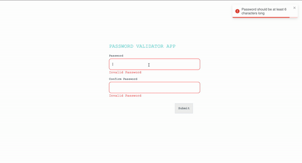

# Password Validator App

## Overview

Welcome to the Password Validator App, a small React project designed to help you validate and compare passwords. This application features two input fields where you can enter passwords, and it provides real-time validation to ensure they meet certain criteria.

## Features

- Passwords must match.
- Minimum length of 6 characters.
- Must contain at least one uppercase letter.
- Must contain at least one lowercase letter.
- Must contain at least one number.
- Must contain at least one special character.


# 🎥 [Demo](https://vimeo.com/903423472)
  
  


## Getting Started

Follow these steps to run the Password Validator App on your local machine:

1. Clone the repository:

   ```bash
   git clone https://github.com/codinghexagon/Password-Validator
   ```

2. Navigate to the project directory:

   ```bash
   cd password-validator
   ```

3. Install dependencies:

   ```bash
   npm install
   ```

4. Start the development server:

   ```bash
   npm start
   ```

5. Open your web browser and go to [http://localhost:3000](http://localhost:3000) to use the Password Validator App.

## Usage

1. Enter a password in the first input field.
2. Enter the same password in the second input field.
3. Observe real-time validation feedback:
   - Passwords match or do not match.
   - Check if the password meets the minimum length requirement.
   - Verify the presence of uppercase, lowercase, numeric, and special characters.

## Technologies Used

- React
- JavaScript
- SCSS

## Contributing

Feel free to contribute to the project by submitting issues or pull requests. Your feedback and contributions are highly appreciated.


---

Thank you for using the Password Validator App! If you encounter any issues or have suggestions for improvement, please don't hesitate to reach out. Happy validating!